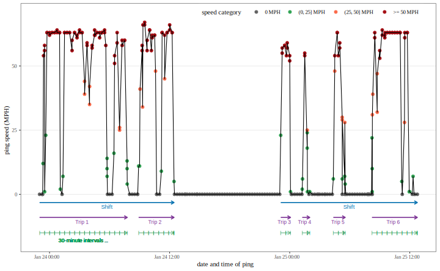

```{r setup, include=FALSE}
knitr::opts_chunk$set(echo = TRUE)
```


```{r}
pacman::p_load(DT, dplyr, data.table, lubridate)
```


All the data sets present here are simulated for the purpose of demonstration and example. They do not reflect the true demographics, driving patterns, or the unsafe driving events.

Data Description
================

Ping
----

```{r}
(ping = fread('Data/ping.csv'))
```


SCEs
----

```{r}
(sce = fread('Data/ping.csv'))
```


Weather
-------

```{r}
(weather = fread('Data/weather.csv'))
```


Data aggregation
================


Shift
-----


Trip
----


30-minute intervals
-------------------


Data merging
===============


Statistical modeling
====================


Model comparison
================


Session info
================
```{r}
sessionInfo()
```

